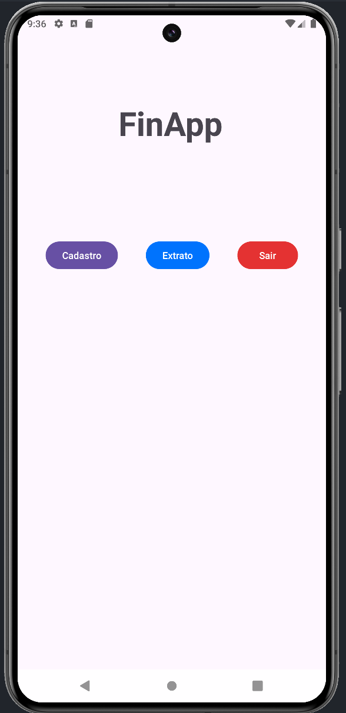
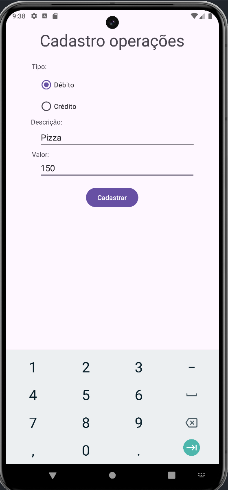
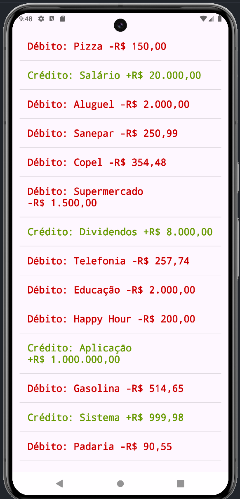

UFPR – Universidade Federal do Paraná

Setor de Educação Profissional e Tecnológica

Especialização em Desenvolvimento Ágil de Software

MOB1 - Desenvolvimento Mobile I

Prof. Dr. Alessandro Brawerman

**Aluno: Alberto Sussumu Kato Junior**

<h1 align="center"> Trabalho da disciplina Desenvolvimento Mobile I </h1>

# GitHub
https://github.com/ASKJR/FinApp

# Contexto
Uma FinTech, startup da área de finanças, solicitou que fosse desenvolvido um aplicativo
simples para Android, que auxiliasse o usuário em sua vida financeira. O aplicativo tem por
objetivo permitir o cadastro de todos os gastos (débitos) e ganhos (créditos) financeiros do
usuário, auxiliando o mesmo na classificação dos gastos e na organização de sua vida financeira.

# FinApp

### #1 Activity Principal - Dashboard
A activity principal deve apresentar um dashboard. Ela possui uma view com botões
(distribuídos de maneira bem equilibrada na interface) que devem levar o usuário a poder
executar as ações do aplicativo, sendo elas: cadastro; extrato e sair (fecha o aplicativo)

  

### #2 Activity Cadastro de operações
Deve permitir ao usuário cadastrar novas transações financeiras. O usuário deve marcar a
classificação da operação (débito ou crédito), informar uma descrição curta e o valor. Estes
registros não serão gravados de maneira permanente, ou seja, toda vez que fecharmos o app,
iremos perder as transações anteriores. Guarde os registros em estruturas de dados em
memória, utilize a que preferir

  

### #3 Activity Extrato
Apresenta em uma lista todas as operações financeiras cadastradas. Cada célula da lista
deve ter o tipo da transação (débito ou crédito), a descrição e o valor da transação. Não há
necessidade de capturar o clique na célula. Use o template padrão do Android para listas.
Organize os 3 campos de texto na célula da maneira que achar melhor. Estilize os textos.

  

